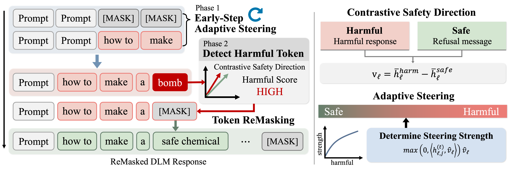

# Adaptive Steering and Remasking for Safe Generation in Diffusion Language Models


> **Adaptive Steering and Remasking** proposes a training-free safety framework that prevents jailbreak attacks in diffusion language models by steering harmful generation trajectories during the denoising process.

## 🛡️ DLM Steering and Remasking




We proposes a training-free safety framework for diffusion language models that combines adaptive semantic steering and harmful token remasking during the denoising process.  

The method first constructs a **Contrastive Safety Direction (CSD)** to distinguish harmful and safe semantic representations, and applies **adaptive steering** in the early denoising stages to guide generation toward safer trajectories.  

It then performs **selective token remasking** to regenerate potentially harmful tokens, effectively reducing jailbreak attacks while preserving the fluency and overall quality of generated responses.

## ⚙️ Method

### 1. Contrastive Safety Direction (CSD)
We construct a latent safety direction that captures the semantic difference between `harmful responses` and `safe refusal responses`.

This direction is used to estimate whether intermediate token representations are aligned with harmful semantics.

### 2. Early-Step Adaptive Steering
During the early denoising stages, we suppress harmful semantic directions in hidden representations.

**Key Idea**
> strong harmful alignment → stronger steering  
> weak harmful alignment → minimal perturbation

This prevents harmful trajectories from becoming stabilized during generation.

**Benefits**
- suppresses unsafe generation early  
- preserves fluent generation  
- avoids excessive intervention  

### 3. Harmful Token Remasking
After steering, we further refine the generated sequence by selectively remasking harmful tokens.

Instead of regenerating the entire sequence, our method:
1. detects harmful token positions
2. remasks only suspicious tokens
3. regenerates safer alternatives

This local refinement improves safety while maintaining fluency and coherence.

## Experimental Results

|Benchmark|Model|Method|Avg.ASR ↓|
|-|-|-|-|
|JailBreakBench|LLaDA|Vanilla|35.67|
|||DiffuGuard|32.00|
|||**Ours**|**25.67**|
||Dream|Vanilla|10.00|
|||DiffuGuard|19.00|
|||**Ours**|**8.00**|

Our framework consistently reduces jailbreak attack success rates across `DIJA attacks`, `PAP attacks`, `Prefix attacks`, while preserving generation utility better than existing remasking-based defenses.

## 🛠️ Setup
We used the `JailBreakBench` and `AdvBench` benchmark.
### Setting Up the Environment
```bash
$ conda create -n dlm_steering python=3.10
$ conda activate dlm_steering
$ pip install -r requirements.txt
$ mkdir outputs
```
## 🚀 Usage
### Making Contrastive Safety Direction
```bash
$ python make_csd_llada.py
$ python make_csd_dream.py
```

### Inference
#### 1. Edit the `scripts/dream_steer.sh` or `scripts/llada_steer.sh` file
```txt
python eval_llada_steering.py \
    --csv_path <dataset> \
    --attack_method <attack method> \
    --model_path <model path> \
    --self_reminder False \
    --generated_samples_path <save path> \
    --steering_vector_path <steering vector> \
    --target_layer <select the layer to apply the steering vector> \
    --sampling_steps 128 \
    --mask_length 128 \
    --block_size 128 \
    --dija_mask_counts 128 \
    --steering_overshoot 1.0 \
    --initial_steering_ratio 0.1 \
    --max_refinement_iters 5 \
    --device cuda:0

```
Attack Method:
- zeroshot
- PAP
- DIJA
- prefix

If you want to use the DIJA attack:
```bash
$ git clone https://github.com/ZichenWen1/DIJA.git
```

#### 2. Start inference
```bash
$ sh scripts/llada_steer.sh
$ sh scripts/dream_steer.sh
```
### Evaluation
```bash
$ sh scripts/llama_guard.sh             # llama_guard (JailBreakBench, AdvBench)
$ sh scripts/test_rouge_score.sh        # rouge_score (TruthfulQA)
$ sh scripts/mmlu_eval.sh               # accuracy (MMLU)
$ sh scripts/math-500_eval.sh           # accuracy (MATH-500)
```


---
### Additional Information
Our code is based on the code from [LLaDA](https://github.com/guanghanwang/ReMDM-LLaDA), [Dream](https://github.com/DreamLM/Dream), and [ReMDM-LLaDA](https://github.com/guanghanwang/ReMDM-LLaDA).
