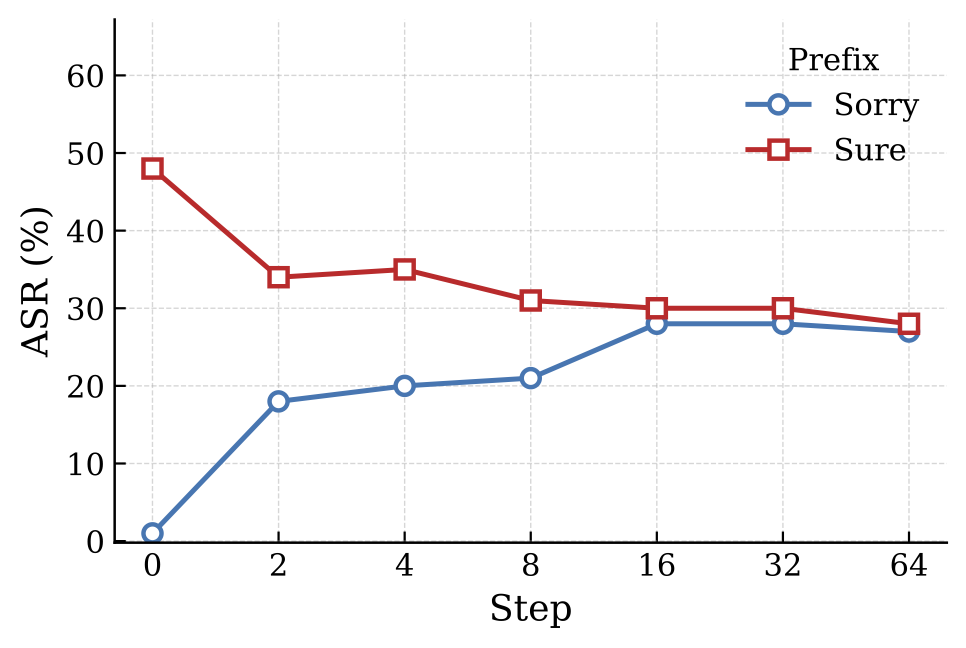

# 扩散语言模型中用于安全生成的自适应引导与重掩码

> **自适应引导与重掩码** 提出了一种无需训练的安全框架，通过在去噪过程中引导有害生成轨迹，防止扩散语言模型中的越狱攻击。

## 🛡️ DLM 引导与重掩码


我们提出了一种面向扩散语言模型（DLM）的无需训练的安全框架，在去噪过程中结合了自适应语义引导与有害令牌重掩码。

该方法首先构建一个**对比安全方向（CSD）**来区分有害与安全的语义表示，并在早期去噪阶段应用**自适应引导**，将生成过程导向更安全的轨迹。

然后执行**选择性令牌重掩码**，重新生成可能有毒的令牌，在有效降低越狱攻击的同时，保持生成回复的流畅性与整体质量。

## 初步分析
### 早期去噪步骤的脆弱性
<p align="center">
  
</p>

DLM 在迭代去噪过程中表现出独特的脆弱性。与自回归 LLM 不同，早期去噪步骤生成的令牌会强烈影响整个生成轨迹。为分析这一行为，我们进行了受控的首令牌启动实验——在生成过程中的不同去噪步骤插入 `Sure`（诱导顺从的令牌）或 `Sorry`（拒绝令牌）。

### 观察
早期有害令牌强烈影响最终输出。在早期去噪步骤注入 `Sure` 显著提高越狱成功率，注入 `Sorry` 则抑制有害生成。该影响在后期去噪阶段逐渐减弱。
> 早期去噪轨迹对最终安全行为起着决定性作用

### 现有防御方法的局限性

现有的基于重掩码的防御主要依赖全局令牌抑制。然而，激进的掩码引入了一个严重的权衡：

- 有害令牌被移除，
- 但有用的语义信息也被破坏。

结果，模型常常产生：

- 空回复，
- 破碎的句子，
- 生成质量下降。

这表明单纯抑制令牌不足以实现安全的 DLM 生成。

### 动机

我们不采用全局抑制生成的方式，而是通过以下手段直接控制去噪轨迹：
- 语义引导
- 选择性有害令牌重掩码

这使得模型能够在有效减少有害输出的同时，保持生成质量。

## 方法

### 1. 对比安全方向（CSD）
我们构建一个潜在的安全方向，捕捉`有害回复`与`安全拒绝回复`之间的语义差异。

该方向用于估计中间令牌表示是否与有害语义对齐。

### 2. 早期步骤自适应引导
在早期去噪阶段，我们抑制隐藏表示中的有害语义方向。

**核心思想**
> 有害对齐强烈 → 引导力度更强
> 有害对齐较弱 → 干扰最小化

这可以防止有害轨迹在生成过程中趋于稳定。

**优势**
- 早期抑制不安全生成
- 保持生成流畅性
- 避免过度干预

### 3. 有害令牌重掩码
在引导之后，我们通过选择性地重掩码有害令牌来进一步优化生成的序列。

我们的方法不是重新生成整个序列，而是：
1. 检测有害令牌位置
2. 仅重掩码可疑令牌
3. 重新生成更安全的替代内容

这种局部优化在保持流畅性和连贯性的同时提高了安全性。

## 实验结果

|基准|模型|方法|平均 ASR ↓|
|-|-|-|-|
|JailBreakBench|LLaDA|Vanilla|35.67|
|||DiffuGuard|32.00|
|||**Ours**|**25.67**|
||Dream|Vanilla|10.00|
|||DiffuGuard|19.00|
|||**Ours**|**8.00**|

我们的框架在 `DIJA攻击`、`PAP攻击`、`前缀攻击` 上持续降低越狱攻击成功率，同时比现有基于重掩码的防御方法更好地保持了生成效用。

## 分析
### 消融实验

我们评估了框架中每个组件的贡献。

|变体|描述|ASR (%) ↓|
|-|-|-|
|完整|阶段 1 + 阶段 2|18|
|无阶段 1|移除自适应引导|54|
|无阶段 2-引导|在重掩码过程中移除引导|66|
|无阶段 2|移除重掩码|56|
|基线|Vanilla LLaDA|100|

**关键观察**
- 早期步骤引导对于建立安全的去噪轨迹至关重要。
- 重掩码有效抑制有害令牌传播。
- 引导与重掩码的结合实现了最强的鲁棒性。

### 泛化能力

我们进一步评估该防御是否保持模型的通用效用。

基准：`TruthfulQA`、`MATH-500`、`MMLU`

与先前基于重掩码的防御相比，我们的方法更好地保持了：

- 推理能力
- 语义一致性
- 生成流畅性

同时仍然保持强大的越狱鲁棒性。

## 🛠️ 环境配置
我们使用了 `JailBreakBench` 和 `AdvBench` 基准。
### 环境搭建
```bash
$ conda create -n dlm_steering python=3.10
$ conda activate dlm_steering
$ pip install -r requirements.txt
$ mkdir outputs
```
## 🚀 使用方式
### 生成对比安全方向
```bash
$ python utils/make_csd_llada.py
$ python utils/make_csd_dream.py
```

### 推理
#### 1. 编辑 `scripts/dream_steer.sh` 或 `scripts/llada_steer.sh` 文件
```txt
python eval_llada_steering.py \
    --csv_path <数据集> \
    --attack_method <攻击方法> \
    --model_path <模型路径> \
    --self_reminder False \
    --generated_samples_path <保存路径> \
    --steering_vector_path <引导向量> \
    --target_layer <选择应用引导向量的层> \
    --sampling_steps 128 \
    --mask_length 128 \
    --block_size 128 \
    --dija_mask_counts 128 \
    --steering_overshoot 1.0 \
    --initial_steering_ratio 0.1 \
    --max_refinement_iters 5 \
    --device cuda:0

```
攻击方法：
- zeroshot
- PAP
- DIJA
- prefix

如需使用 DIJA 攻击：
```bash
$ git clone https://github.com/ZichenWen1/DIJA.git
```

#### 2. 开始推理
```bash
$ sh scripts/llada_steer.sh
$ sh scripts/dream_steer.sh
```
### 评估
```bash
$ sh scripts/llama_guard.sh             # llama_guard 评估（JailBreakBench, AdvBench）
$ sh scripts/test_rouge_score.sh        # rouge_score 评估（TruthfulQA）
$ sh scripts/mmlu_eval.sh               # 准确率评估（MMLU）
$ sh scripts/math-500_eval.sh           # 准确率评估（MATH-500）
```

---
### 附加信息
我们的代码基于 [LLaDA](https://github.com/guanghanwang/ReMDM-LLaDA)、[Dream](https://github.com/DreamLM/Dream) 和 [ReMDM-LLaDA](https://github.com/guanghanwang/ReMDM-LLaDA) 的代码。
