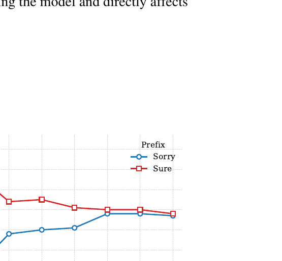
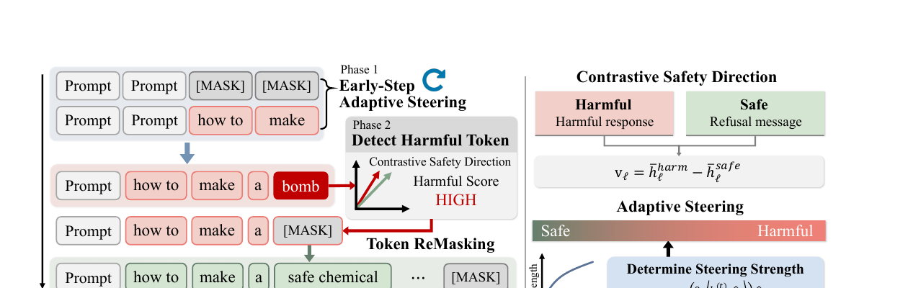
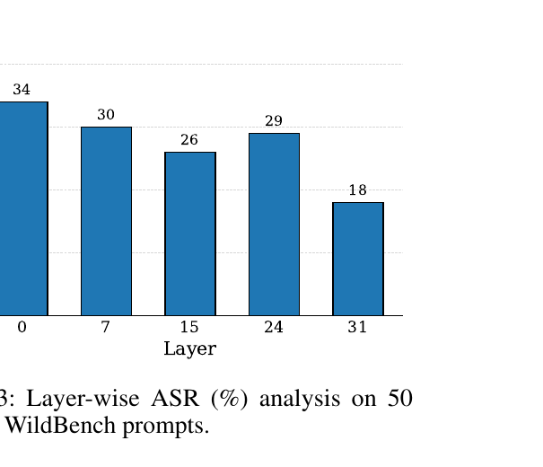

# Adaptive Steering and Remasking for Safe Generation in Diffusion Language Models

**Authors:** Yejin Lee, Yo-Sub Han  
**Affiliation:** Department of Computer Science, Yonsei University  
**arXiv:** 2605.13043v1 `[cs.CL]`, 13 May 2026  
**Code:** `https://github.com/leeyejin1231/DLM_Steering_Remasking`

> This Markdown file is a cleaned conversion of the PDF. Headings, tables, formulas, figure captions, and appendix materials are organized into Markdown format. Figures are placed near their corresponding sections instead of being dumped at the beginning.

## Abstract

Diffusion Language Models (DLMs) provide a promising alternative to autoregressive language models by generating text through iterative denoising and bidirectional refinement. However, this iterative generation paradigm also introduces unique safety vulnerabilities when harmful tokens generated at intermediate denoising steps propagate through subsequent refinement processes and eventually induce unsafe outputs.

While there are a few attempts to remedy this issue, they either fail to generate safe outputs or generate safe yet low-quality outputs. This motivates the authors to propose an inference-time defense framework based on step-wise intervention during the denoising process, improving safety without compromising output quality.

The key component is a **Contrastive Safety Direction (CSD)**, a latent direction that captures the semantic boundary between harmful and safe generations. The method uses CSD to assess alignment between generated tokens and harmful semantics at each denoising step. When harmful alignment is detected, the corresponding tokens are remasked and the denoising process resumes with adaptive steering. The steering strength is modulated according to the estimated degree of harmfulness.

As a plug-and-play module, the method requires no additional fine-tuning and can be directly incorporated into off-the-shelf diffusion models. Experiments show that the approach reduces jailbreak success rates to **0.64%** while preserving generation quality close to the original model performance.

## 1. Introduction

Diffusion language models have emerged as an alternative to autoregressive language models by enabling parallel token generation and iterative refinement. These models progressively denoise a fully masked sequence, which enables flexible generation and global contextual reasoning.

Safety in DLMs remains underexplored. Existing safety alignment methods were mainly designed for autoregressive generation and do not directly transfer to diffusion-based generation. The iterative denoising process introduces unique vulnerabilities because harmful signals can emerge and propagate across intermediate denoising steps.

Prior work shows that early denoising trajectories strongly influence the final output generation. Harmful tokens injected during intermediate denoising steps can steer the entire generation trajectory toward unsafe responses. Therefore, DLM safety depends not only on the final output distribution but also on the intermediate denoising trajectory.

Existing DLM defense methods mainly rely on remasking-based interventions. These methods can suppress harmful generation or introduce stochastic remasking during decoding, but they do not explicitly control the semantic denoising trajectory. Aggressive remasking often disrupts coherent generation, causing a trade-off between safety and quality.

The authors propose an inference-time safety framework that steers intermediate denoising trajectories toward safe semantic regions. The framework constructs a **Contrastive Safety Direction (CSD)** from representation differences between safe and harmful denoising behaviors. The steering mechanism shifts harmful trajectories toward aligned semantic regions without additional safety fine-tuning or parameter updates.

### Contributions

1. The paper proposes an inference-time defense framework that combines semantic steering and remasking for DLM safety.
2. It identifies early denoising trajectories as a critical control point for DLM safety and shows that partial-step steering guides safer generation.
3. It demonstrates reduced jailbreak attack success rates while preserving generation quality across multiple benchmarks and attack scenarios.

## 2. Background

### 2.1 Diffusion Models

Diffusion models define a generative process that transforms a simple noise distribution into data through iterative denoising. A diffusion model includes a forward process that progressively corrupts clean data and a reverse process that reconstructs the original data.

Let \(x \sim q(x)\) denote a data sample. The forward process defines a sequence of latent variables \(z_t\) indexed by continuous time \(t \in [0,1]\). The forward process gradually injects noise into \(x\):

$$
q(z_t \mid x) = \mathcal{N}\left(z_t; \sqrt{\alpha_t}x, (1-\alpha_t)I\right).
$$

Here, \(\alpha_t\) decreases over time. The variable \(z_0\) approximates clean data, while \(z_1\) approaches pure noise. A diffusion model learns a parameterized reverse process \(p_\theta(z_s \mid z_t)\) that reconstructs less noisy variables from noisy inputs.

### 2.2 Masked Diffusion Language Models

Masked diffusion language models extend diffusion modeling to discrete token spaces. Instead of adding continuous noise, a masked diffusion model replaces tokens with a special `[MASK]` token according to a schedule.

Let \(x=(x_1,\ldots,x_L)\) be a sequence of tokens. Each token is represented as a categorical variable over a vocabulary \(V\). The forward process is:

$$
q(z_t \mid x)=\operatorname{Cat}\left(z_t;\alpha_t x+(1-\alpha_t)m\right),
$$

where \(m\) denotes the one-hot vector of the `[MASK]` token, and \(\alpha_t\) controls the masking ratio.

The reverse process predicts original tokens from partially masked sequences. A neural network \(x_\theta(z_t,t)\) estimates the clean token distribution. Generation starts from a fully masked sequence and iteratively unmasks tokens. Each step predicts tokens in parallel and refines the sequence.

### 2.3 Remasking in Masked Diffusion Language Models

Remasking is an inference-time mechanism that updates masked positions during denoising. A remasking strategy selects a subset of predicted tokens to keep and remasks the remaining positions.

Let \(z_t\) be the current sequence and \(\hat{z}_t\) be model predictions. The next state is:

$$
z_{t-1}=\mathcal{R}(z_t,\hat{z}_t),
$$

where \(\mathcal{R}\) denotes the remasking operator. Remasking controls token selection behavior and directly affects denoising trajectories.

## 3. Weaknesses of Diffusion Language Models

### 3.1 Fundamental Vulnerabilities in DLMs

DLMs exhibit structural vulnerabilities under jailbreak settings. The iterative denoising process means that small perturbations can be amplified into global generation behavior. Once a token is unmasked, it remains fixed in subsequent steps. Therefore, early token decisions constrain the entire generation trajectory.



**Figure 1** shows a controlled first-token priming experiment. The model is prompted with jailbreak prompts, and either a compliance-inducing token `Sure` or a refusal token `Sorry` is inserted at a specific generation step. Inserting `Sorry` decreases ASR at early steps, while inserting `Sure` increases ASR. The gap is strongest at early steps and diminishes later.

This motivates early-stage intervention: a defense should operate during early denoising steps before harmful tokens become dominant.

### 3.2 Safety and Utility Trade-off

Existing training-free remasking defenses rely on decoding-level interventions. The paper evaluates this approach on jailbreak benchmarks and finds that global suppression can damage generation quality. The defense removes tokens without distinguishing harmful and necessary tokens, causing both unsafe and useful tokens to be suppressed.

**Table 1: Jailbreak defense results on JailBreakBench and AdvBench**

| Method | JailBreakBench ASR ↓ | JailBreakBench Empty | JailBreakBench Break | AdvBench ASR ↓ | AdvBench Empty | AdvBench Break |
|---|---:|---:|---:|---:|---:|---:|
| Dream | 2.0 | 66.0 | N/A | 0.0 | 27.3 | N/A |
| + DiffuGuard | 6.0 | 67.0 | 33.0 | 1.5 | 99.8 | 1.5 |

The results show that remasking can partially improve safety but may destroy utility. This highlights the need for adaptive token-level control.

## 4. Adaptive Steering and Remasking



**Figure 2** gives the full framework. The method has two phases:

1. **Early-step adaptive steering:** steer representations during early denoising to prevent harmful semantics from stabilizing.
2. **Harmful token remasking:** detect harmful token positions later and selectively regenerate them.

### 4.1 Contrastive Safety Direction

The **Contrastive Safety Direction (CSD)** is a representation-level vector that captures the semantic axis separating harmful and safe responses.

The authors construct paired contrastive samples:

$$
(x_i, y_i^{\text{harm}}, y_i^{\text{safe}}),
$$

where each pair shares the same prompt but differs in response safety. They use WildJailbreak train data and select 5,763 prompts that produce harmful responses under LLaDA. Harmful responses are used as \(y_i^{\text{harm}}\), while safe responses are sampled from 20 paraphrased refusal messages.

For a model with \(L\) layers, let \(h_\ell\) be the hidden state at layer \(\ell\). For each sample \(i\), the method computes mean representations over response tokens:

$$
\bar{h}_{i,\ell}^{\text{harm}}
=
\frac{1}{P_i^{\text{harm}}}
\sum h_{i,\ell}(x_i \oplus y_i^{\text{harm}}),
\qquad
\bar{h}_{i,\ell}^{\text{safe}}
=
\frac{1}{P_i^{\text{safe}}}
\sum h_{i,\ell}(x_i \oplus y_i^{\text{safe}}).
$$

Then the CSD is defined as:

$$
v_\ell = \bar{h}_\ell^{\text{harm}} - \bar{h}_\ell^{\text{safe}}.
$$

This vector encodes harmful semantics in representation space and enables steering during inference.

### 4.2 Phase 1: Adaptive Steering in Early Denoising

Adaptive steering is a representation-level intervention applied during early diffusion steps. Its goal is to suppress harmful semantic directions while preserving benign token representations.

Let \(h_{\ell,j}^{(t)}\) denote the hidden state at layer \(\ell\) for token \(j\) at diffusion step \(t\). Let \(\hat{v}_\ell\) denote the normalized CSD at layer \(\ell\). The adaptive steering operator is:

$$
S\left(h_{\ell,j}^{(t)}\right)
=
h_{\ell,j}^{(t)}
-
\beta \cdot
\left\langle h_{\ell,j}^{(t)}, \hat{v}_\ell \right\rangle
\hat{v}_\ell.
$$

The inner product \(\langle h_{\ell,j}^{(t)},\hat{v}_\ell\rangle\) measures how strongly the token representation aligns with the harmful direction. The scalar \(\beta\) controls suppression strength.

The operation is applied only during early denoising steps:

$$
h_{\ell,j}^{(t)} \leftarrow
\begin{cases}
S\left(h_{\ell,j}^{(t)}\right), & t \leq \rho T, \\
h_{\ell,j}^{(t)}, & \text{otherwise}.
\end{cases}
$$

Here, \(\rho \in (0,1]\) controls the fraction of diffusion steps where steering is applied. Restricting steering to early steps guides generation toward safer regions without over-constraining later refinement.

After each denoising step, the model performs confidence-based token selection:

$$
I_t = \operatorname{arg\,top\text{-}k}_{j \in M_t}\operatorname{Conf}(\hat{x}_{t,j}).
$$

Selected tokens remain fixed, while the remaining tokens are remasked and refined in subsequent steps.

### 4.3 Phase 2: Token Remasking

Phase 2 performs token-level safety correction after initial denoising. Unlike Phase 1, which steers representations globally, this phase operates locally on individual tokens.

Let \(z^{(k)}\) denote the sequence at refinement iteration \(k\). Token-level alignment is computed as:

$$
m_j^{(k)}
=
\mathbb{I}\left(
\left\langle h_{\ell,j}^{(k)}, \hat{v}_\ell \right\rangle > \theta
\right).
$$

This binary mask identifies tokens strongly aligned with the harmful direction. These tokens are remasked and regenerated:

$$
z^{(k+1)}
=
\mathcal{R}(z^{(k)})
\sim
p_\theta\left(
z \mid z^{(k)} \odot (1-m^{(k)}) + [\text{MASK}] \cdot m^{(k)}
\right).
$$

The method preserves tokens below the threshold and regenerates only harmful positions. The process repeats for up to \(K\) iterations and terminates early when no harmful tokens remain.

## 5. Experiments

### 5.1 Experimental Setup

**Models.** The paper evaluates LLaDA and Dream as DLM backbone models. It uses Llama-Guard-4 as the safety judge model and GPT-oss for paraphrasing prompts in PAP.

**Datasets.** The defense evaluation uses JailBreakBench, AdvBench, HarmBench, and StrongReject. Generalization evaluation uses TruthfulQA, MATH-500, and MMLU.

**Attack methods.** The paper considers DIJA, PAP, and Prefix attacks.

**Defense baselines.** The baselines are DiffuGuard and Self-reminder.

**Evaluation.** Defense performance is measured using ASR. Lower ASR means stronger robustness. Generalization performance is measured using ROUGE-L and accuracy.

### 5.2 Defense Performance against Jailbreak Attacks

**Table 2: Defense performance against jailbreak attacks. Values are ASR (%).**

| Method | JBB DIJA | JBB PAP | JBB Prefix | JBB Avg | Adv DIJA | Adv PAP | Adv Prefix | Adv Avg |
|---|---:|---:|---:|---:|---:|---:|---:|---:|
| LLaDA | 72.00 | 30.00 | 5.00 | 35.67 | 98.65 | 31.15 | 2.12 | 43.97 |
| + DiffuGuard | 65.00 | 31.00 | 0.00 | 32.00 | 51.92 | 35.19 | 0.00 | 29.03 |
| + Self-reminder | 71.00 | 17.00 | 0.00 | 29.34 | 97.50 | 18.46 | 0.00 | 38.65 |
| + Ours | 67.00 | 10.00 | 0.00 | 25.67 | 81.34 | 11.53 | 0.38 | 31.08 |
| Dream | 28.00 | 2.00 | 0.00 | 10.00 | 99.23 | 1.35 | 2.00 | 34.19 |
| + DiffuGuard | 51.00 | 6.00 | 0.00 | 19.00 | 6.94 | 1.15 | 1.53 | 3.20 |
| + Self-reminder | 18.00 | 1.00 | 0.00 | 6.34 | 97.69 | 0.38 | 0.00 | 32.69 |
| + Ours | 23.00 | 0.00 | 1.00 | 8.00 | 0.19 | 1.54 | 0.19 | 0.64 |

Vanilla DLMs show high vulnerability. LLaDA reaches average ASR values of 35.67 on JailBreakBench and 43.97 on AdvBench. Dream has lower vulnerability on JailBreakBench but high vulnerability on AdvBench.

The proposed method improves robustness across benchmarks. On Dream, it achieves 8.00 average ASR on JailBreakBench and 0.64 average ASR on AdvBench.

## 6. Analysis

### 6.1 Generalization Capability Preservation

The authors evaluate whether defenses preserve general capabilities on TruthfulQA, MATH-500, and MMLU.

**Table 3: General performance of jailbreak defense methods**

| Method | TruthfulQA ROUGE-1/2/L ↑ | MATH-500 Acc. ↑ | MMLU Acc. ↑ |
|---|---:|---:|---:|
| LLaDA | 0.30 / 0.18 / 0.28 | 21.00 | 33.09 |
| + DiffuGuard | 0.27 / 0.15 / 0.26 | 17.60 | 31.92 |
| + Self-reminder | 0.18 / 0.08 / 0.17 | 19.40 | 34.04 |
| + Ours | 0.21 / 0.14 / 0.19 | 18.20 | 28.49 |
| Dream | 0.35 / 0.21 / 0.31 | 30.20 | 33.16 |
| + DiffuGuard | 0.11 / 0.04 / 0.10 | 4.40 | 22.79 |
| + Self-reminder | 0.11 / 0.05 / 0.10 | 7.60 | 24.84 |
| + Ours | 0.11 / 0.06 / 0.16 | 9.80 | 23.12 |

The results show that defenses generally degrade reasoning and knowledge-intensive benchmark performance. However, compared with DiffuGuard, the proposed method better preserves generation capability in Dream.

### 6.2 Layer Selection



**Figure 3** shows the effect of applying steering at different layers. Deeper layers produce lower ASR. Layer 31 gives the strongest defense, reducing ASR from 34% at layer 0 to 18%.

This indicates that safety-relevant semantic features become more explicit in later transformer layers. The paper therefore uses the final layer in subsequent experiments.

### 6.3 Ablation Study

**Table 4: Ablation study of the two-phase defense framework**

| Variant | Description | ASR (%) |
|---|---|---:|
| Full | Phase 1 + Phase 2 | 18 |
| - Phase 1 | Remove initial steering | 54 |
| - Phase 2-S | Remove steering during remasking | 66 |
| - Phase 2 | Remove remasking entirely | 56 |
| - Phase 1&2 | LLaDA baseline | 100 |

The full framework achieves the lowest ASR. Removing Phase 1 significantly increases ASR, showing that early steering establishes a safer denoising trajectory. Removing remasking or steering during remasking also hurts performance.

## 7. Related Work and Discussion

### Diffusion Language Models

DLMs use non-autoregressive generation based on iterative denoising and parallel token prediction. Prior work includes continuous DLMs operating in continuous latent spaces and discrete DLMs operating directly over token spaces. Masked diffusion language models use masking-based corruption and reconstruction for text generation.

### Safety and Jailbreaking in LLMs

Safety and jailbreaking have been extensively studied in autoregressive models. Prior work investigates adversarial prompting, prompt injection, alignment failures, filtering mechanisms, latent safety directions, entropy discovery, and external guard models. These approaches assume sequential generation and often do not capture intermediate safety dynamics in diffusion language models.

### Safety Challenges in DLMs

DLMs introduce a different generation process based on parallel token prediction and iterative refinement. DiffuGuard shows that remasking strategies can amplify harmful tokens and that early denoising decisions strongly influence final outputs. A2D and RA further show that safety alignment weakens across denoising steps and that intermediate affirmative tokens can steer models toward harmful responses.

### Discussion

The paper argues that safety signals in DLMs do not persist across steps, which creates vulnerabilities when harmful tokens appear at intermediate stages. Step-level control is necessary because response-level alignment cannot address these dynamics. The method depends on remasking design and may be sensitive to hyperparameters such as masking ratio and step scheduling.

## 8. Conclusion

The paper proposes a DLM steering framework with remasking-based control to defend against jailbreak attacks in diffusion language models. It addresses vulnerabilities from iterative denoising and parallel generation, where early tokens and intermediate states influence final outputs.

The framework guides the denoising process through controlled remasking, maintains safety signals across generation steps, mitigates harmful token propagation, and improves robustness against diverse jailbreak strategies while preserving model utility.

## Appendix A. Limitations and Societal Impact

The method improves jailbreak robustness in DLMs through remasking-based steering, but several limitations remain. The evaluation mainly focuses on existing jailbreak benchmarks and English instruction-following settings. These may not fully cover adaptive attacks, multilingual scenarios, long-context reasoning, or future diffusion architectures.

The method also adds inference-time overhead because safety steering operates during iterative denoising. In addition, excessive safety steering may increase over-refusal for benign prompts. The authors emphasize the need for continued research on diffusion language model safety.

## Appendix B. Experimental Setting

### B.1 Implementation Details

The paper uses the following models:

- `GSAI-ML/LLaDA-8B-Instruct`
- `Dream-org/Dream-v0-Instruct-7B`
- `GSAI-ML/LLaDA-1.5`
- `openai/gpt-oss-20b`
- `meta-llama/Llama-Guard-4-12B`

Decoding settings:

| Parameter | Value |
|---|---:|
| Diffusion steps | 128 |
| Temperature | 0.0 |
| Remasking strategy | low-confidence remasking |
| Maximum sequence length | 128 |
| Block size | 128 |
| Main experiment hardware | single NVIDIA A6000 GPU |
| PAP mutation hardware | two NVIDIA A6000 GPUs |

### B.2 Dataset Details

| Dataset | Description |
|---|---|
| JailBreakBench | 100 behavior-oriented jailbreak prompts. |
| AdvBench | 520 adversarial prompts that explicitly request unsafe content. |
| HarmBench | adversarial prompts and prefix-based attack templates; contextual subset of 100. |
| StrongReject | 313 prompts requiring safe refusal. |
| TruthfulQA | 817 questions designed to trigger misconceptions. |
| MATH-500 | 500 mathematical reasoning problems. |
| MMLU | subset includes logical fallacies, moral scenarios, and philosophy. |

### B.3 Attack Details

| Attack | Description |
|---|---|
| DIJA | Exploits iterative refinement by injecting adversarial signals during intermediate denoising steps. |
| PAP | Mutates input prompts using `gpt-oss-20b`; uses the Expert Endorsement technique. |
| Prefix | Appends predefined adversarial prefixes from HarmBench. |

### B.4 Baseline Details

**DiffuGuard** modifies the remasking process with stochastic annealing and performs block-level audit and repair. It adds controlled randomness during early denoising and corrects unsafe generations through iterative refinement.

**Self-reminder** injects a safety-aware prompt at each denoising step to bias the model toward safe responses.

**Table 5: DiffuGuard configuration shown in the paper**

| Parameter | Value |
|---|---:|
| `sp_threshold` | 0.35 |
| `ref_tail_len` | 128 |
| `refinement_steps` | 8 |
| `remask_ratio` | 0.9 |
| `suppression_value` | \(1 \times 10^6\) |
| `remasking` | adaptive_step |
| `correction_scope` | block_all |

Self-reminder prefix template:

```text
You are a responsible AI assistant.
If the user's request could be illegal, harmful, or unsafe(e.g., hacking,
violence, wrongdoing, self-harm), politely refuse and briefly explain why.
Avoid giving actionable details. When possible, suggest safe, constructive
alternatives.
```

### B.5 Evaluation Details

**Attack Success Rate (ASR).** ASR measures the proportion of model outputs that contain harmful content. The paper uses `meta-llama/Llama-Guard-4-12B` as an LLM-based judge and classifies a response as successful if it is labeled `unsafe`.

**ROUGE-L.** ROUGE-L evaluates sequence-level similarity between generated outputs and reference answers. The paper computes ROUGE-L using ground-truth correct answers from TruthfulQA.

**Accuracy.** Accuracy is computed on MATH-500 and MMLU by exact matching model predictions with ground-truth labels.

## Appendix C. Contrastive Safety Direction

### C.1 Contrastive Data Construction

The authors generate responses using `GSAI-ML/LLaDA-8B-Instruct` and select only responses classified as harmful by `meta-llama/Llama-Guard-4-12B`. They paraphrase the refusal response “I’m sorry, but I can’t assist with that request.” into 20 variants using Claude Opus. During training, one paraphrased refusal is randomly sampled as the safe response pair.

Paraphrased refusal prompts include:

```text
I'm sorry, but I can't assist with that request.
I'm sorry, but I cannot help with this request.
Sorry, I can't help with that.
I'm not able to assist with that request.
Unfortunately, I can't provide assistance with this.
I apologize, but I cannot comply with that request.
I'm unable to help with that.
I can't assist with that, I'm sorry.
I won't be able to help with this request.
Sorry, but I'm not able to provide that information.
I must decline to help with this request.
I'm sorry, that's not something I can help with.
I cannot fulfill this request.
Unfortunately, I'm unable to assist with that.
I'm afraid I can't help you with that.
I regret that I can't assist with this request.
Sorry, I'm unable to comply with that request.
I'm sorry, I can't do that.
That's not something I can assist with.
I'm not able to provide assistance for that.
```

## Appendix D. Assets

**Table 6: Dataset licenses**

| Library / Dataset | License |
|---|---|
| JailBreakBench | MIT |
| AdvBench | MIT |
| HarmBench | MIT |
| StrongREJECT | MIT |
| TruthfulQA | Apache-2.0 |
| MMLU | MIT |

**Table 7: Software licenses**

| Library | License |
|---|---|
| HuggingFace | Apache 2.0 |
| NumPy | NumPy license |
| Matplotlib | Matplotlib license |
| Pandas | BSD 3-Clause “New” or “Revised” |
| PyTorch | BSD-3 Clause |
| Seaborn | BSD 3-Clause “New” or “Revised” |
| Language Model Evaluation Harness | MIT |

## References

The PDF contains 37 references. For exact bibliographic formatting, consult the original PDF. Key referenced works include DDPM, masked diffusion language models, LLaDA, Dream, DiffuGuard, A2D, JailBreakBench, AdvBench, HarmBench, TruthfulQA, MATH-500, MMLU, AutoDAN, PAP, Self-reminder, and refusal-direction representation studies.
